<p align="center">
  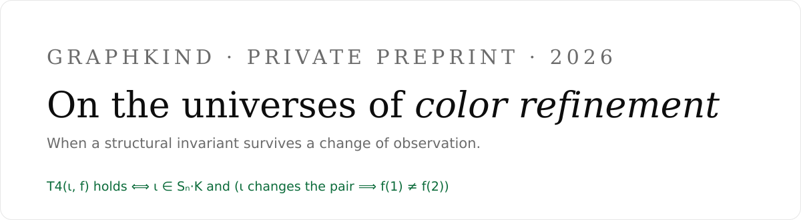
</p>

<p align="center">
  <a href="https://github.com/cripto-bot/graphkind-universos-v2/actions"></a>
  
  
  
</p>

<p align="center">
  <a href="README.md">English</a> · <a href="https://cripto-bot.github.io/graphkind-universos-v2/">Página (ES)</a> · <a href="https://cripto-bot.github.io/graphkind-universos-v2/index.en.html">Page (EN)</a> · <a href="paper/PAPER.md">Paper</a> · <a href="https://huggingface.co/spaces/Jose-dev/graphlab-discoveries-demo">Demo</a> · <a href="paper/LITERATURA.md">Literatura</a> · <a href="paper/PRUEBA-CARACTERIZACION.md">Prueba</a> · <a href="reproduce.sh">Reproducir</a>
</p>

---

## Resumen

Clasificamos los operadores bajo los cuales el perfil del **color
refinement** (1-WL) de un grafo es invariante, dentro de una familia
paramétrica de **universos de observación** `(f, ι)` — `f` comprime los
conteos de vecinos e `ι` es una involución. El motor **propuso y
verificó** que la partición del color refinement es complemento-
invariante (llamado **T4**; mecanismo de conjeturas construido por el
humano), lo verificó en **2 131 019 grafos exhaustivos** (n≤7, 100.0000%)
más 19 407 adversariales, y se
produjo una **prueba escrita** (inyectividad de la resta de multiséts de
vecindades). Parametrizando el universo, **los datos — no los autores —
eligieron la ley del conteo** `T4 ⟺ f(1) ≠ f(2)` (34/34 y 102/102), y
el sondeo posterior produjo una **caracterización**:

$$
T4(\iota, f)\ \text{vive} \iff \iota \in S_n \cdot K
\quad\text{y}\quad
\bigl(\iota\ \text{cambia el par} \implies f(1) \neq f(2)\bigr),
\qquad
K = \{\mathrm{id},\ \mathrm{comp\_dir},\ \mathrm{transp},\ \mathrm{comp\_transp}\} \cong \mathbb{Z}_2 \times \mathbb{Z}_2 .
$$

La **dirección directa está probada** (mecanismo de conteos); la
**recíproca está verificada** exhaustiva en n=4 (96 supervivientes
exactas, cero fuera), dirigida en n=5 (6 424 testigos) y en datos reales
(moléculas 100/100, CST 94/94). Cambiando el **tipo** del invariante —
partición → órbita → distribución → observador — T4 muere en un universo
Z₃ determinista, muere con azar en el proceso, sobrevive con azar en el
objeto, y es **heredado por toda la jerarquía k-FWL** (≡ (k+1)-WL; 51/51). Todo es
reproducible con un comando, cada verificación con un `assert` del
número exacto. Los límites están declarados; cinco bugs propios fueron
cazados por controles y quedan documentados, no borrados.

---

## Contribuciones

1. **T4, propuesto y verificado por el motor**: `CR_k(G) = CR_k(Ḡ)` como
   particiones (no solo multiséts de tamaños iguales) — con prueba
   escrita.
2. **La ley del conteo** `f(1) ≠ f(2)`, **elegida por los datos** tras
   refutar dos hipótesis humanas.
3. **La caracterización** `Sₙ·K` con (⇐) probada y (⇒) verificada; la
   pieza faltante — la **uniformidad** — identificada por falsación.
4. **El cambio de tipo**: T4 a través de universos deterministas,
   dinámicos, probabilísticos y de observadores.
5. **Método**: congelar antes de interpretar, controles negativos, y
   cinco bugs propios cazados y registrados.

---

## 1. El teorema (T4)

Sea `G = (V, E)` un grafo finito simple, `Ḡ` su complemento, y `CR_k(G)`
la partición de `V` inducida por la ronda `k` del color refinement con
colores iniciales `f(tipo, grado)`.

> **Teorema (EXP-086).** Para todo `G` y todo `k ≥ 0`:
> $$CR_k(G) = CR_k(\bar G)$$
> como particiones del **mismo** conjunto de vértices `V` (los nombres
> de los colores difieren; las clases son idénticas).
>
> **Corolario (T4).** Los multiséts de tamaños de las clases estables de
> `CR(G)` y `CR(Ḡ)` coinciden, y coinciden en cada ronda.

<p align="center">
  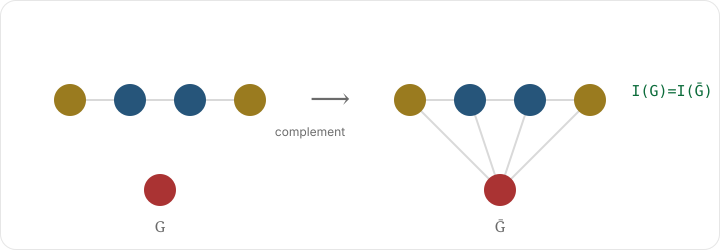
</p>

<p align="center">
  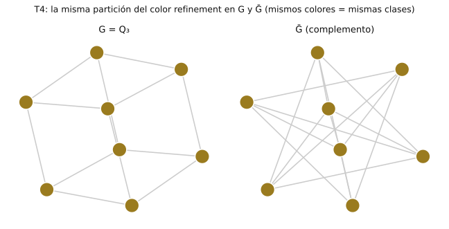
  <br><em>Datos reales: Q₃ y su complemento, vértices coloreados por clase WL — la partición es idéntica (T4).</em>
</p>
<p align="center">
  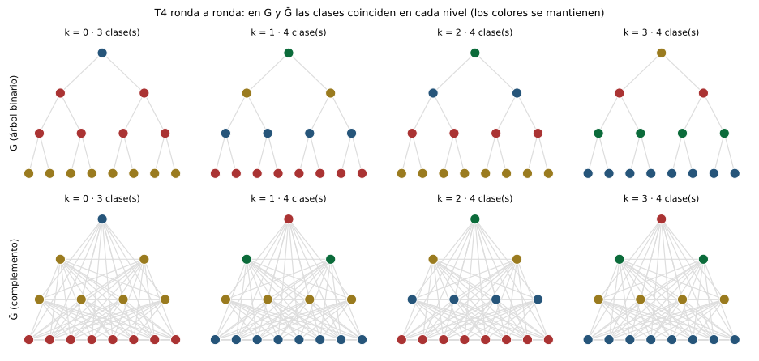
  <br><em>Datos reales: el refinamiento WL ronda a ronda (k=0…3) — G y su complemento mantienen las mismas clases en cada nivel.</em>
</p>

**Prueba (esquema).** *Base.* En `Ḡ`, `deg_Ḡ(v) = n−1−deg_G(v)`; como
`d ↦ n−1−d` es una biyección de grados, la relación "mismo color" es la
misma en `G` y `Ḡ`. *Paso.* Supongamos `CR_k(G) = CR_k(Ḡ) =: P_k`. Para
`v ∈ V`, la vecindad cerrada en `Ḡ` es `N_Ḡ[v] = V ∖ N_G(v)`, y su
multiséts de colores de ronda `k` es

$$M'_k(v) = T_k - \bigl(M_k(v) - [\mathrm{color}_k(v)]\bigr), \qquad T_k := \text{multiséts total de colores de } P_k .$$

Como `T_k` es **fijo**, la aplicación `M_k(v) ↦ M'_k(v)` es
**inyectiva**: `u, v` tienen el mismo multiséts de vecindad cerrada en
`G` si y solo si lo tienen en `Ḡ`. Como `color_{k+1}(v)` es función
determinística de `(color_k(v), M_k(v))`, la relación "mismo color" se
preserva, y `CR_{k+1}(G) = CR_{k+1}(Ḡ)`. ∎

*Estado*: prueba escrita (una página), verificada en 2 131 019 grafos
exhaustivos (n≤7), 19 407 adversariales y 688/688 pares de
compatibilidad; **revisión externa pendiente**.

---

## 2. La ley del conteo

En el universo estándar con una involución que cambia el par conectado:

$$
T4\ \text{vive} \iff f(1) \neq f(2).
$$

**Mecanismo.** En el complemento, un vértice con **1** vecino de una
clase pasa a `|c|−1` (que puede ser **2**): si `f` colapsa 1 y 2, la
dualidad muere. Lo que `f` haga con 3, 4, 5… es irrelevante. Verificada
**34/34** (17 funciones × 2 involuciones, n≤6) y blindada **102/102**
(definición formal de dual global, 6 involuciones × 17 funciones).

<p align="center">
  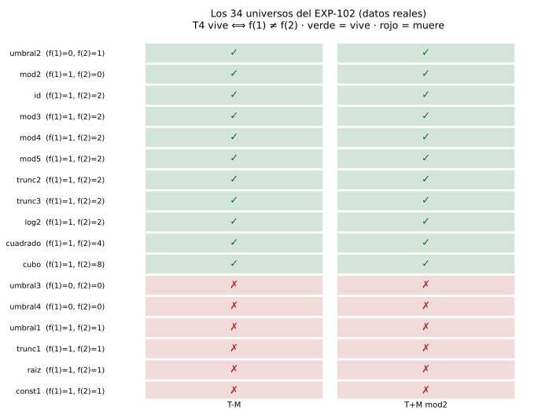
  <br><em>Datos reales: los 34 universos (17 funciones × 2 involuciones) — T4 vive exactamente cuando f(1) ≠ f(2).</em>
</p>

---

## 3. La caracterización

<p align="center">
  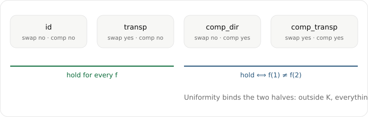
</p>

**Dirección directa (probada).** Para `ι = σ∘s∘c`:

| caso | mecanismo | condición |
|---|---|---|
| **σ** (relabel) | el WL es invariante por isomorfismo; la coloración se transporta biyectivamente | vale para **toda** `f` |
| **s** (swap global in/out) | los conteos se intercambian: `(in_D,out_D) → (out_D,in_D)`; el perfil va por `(f(a),f(b)) → (f(b),f(a))` | vale para **toda** `f` |
| **c** (complemento uniforme) | los conteos van `m → |D|−m` (o `|D|−1−m`), una biyección | vale **si y solo si** `f(1) ≠ f(2)` (contraejemplo en n=6) |

La pieza no obvia es la **uniformidad**: preservar el par *no* alcanza si
la acción no es uniforme (`flip_inc0` preserva el par y muere 0/24).
Fuera de `Sₙ·K`, todo muere.

**Recíproca (verificada).**

| cámara | resultado |
|---|---|
| n=4, espacio inducido, exhaustivo (528 iotas × 4096 digrafos) | **96 supervivientes exactas** (= 24·4), **cero** fuera |
| n=5, dirigida (8 160 iotas) | 7 680 con testigo válido; las 480 sin testigo son uniformes |
| fuera del espacio (10 000 afines aleatorias) | **10 000/10 000** con testigo |
| existencia de testigo (6 424 no uniformes) | **6 424/6 424** testigos válidos |
| datos reales | moléculas **100/100** · CST **94/94** |

<p align="center">
  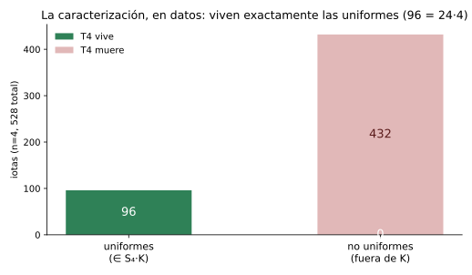
  <br><em>Datos reales: de las 528 iotas inducidas n=4, sobreviven exactamente las 96 uniformes (= 24·4).</em>
</p>

**Búsqueda autónoma.** Con un lenguaje de 11 primitivos + 3
combinadores (~400 recetas) y criterio tasa/MDL, el motor halló que el
mejor testigo **válido** es el `ciclo` (**99.63%**, complejidad 1) —
mejor que la construcción humana (97.8%). Ninguna receta válida llega
al 100%.

---

## 4. De conjetura a teorema candidato

<p align="center">
  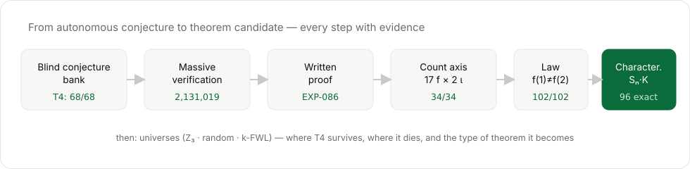
</p>

---

## 5. El cambio de tipo

<p align="center">
  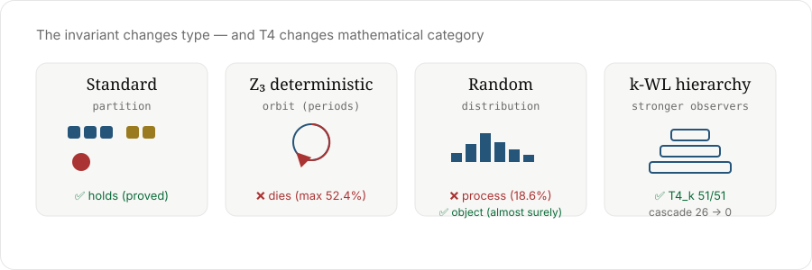
</p>

<p align="center">
  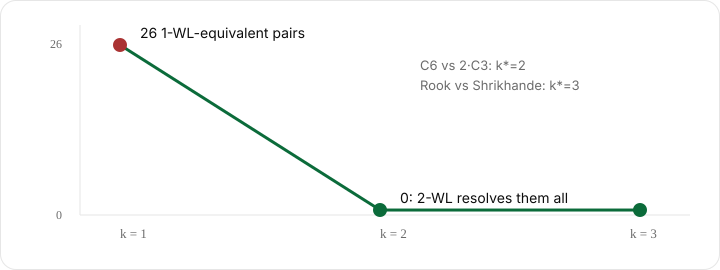
</p>

| universo | invariante | T4 | evidencia |
|---|---|---|---|
| estándar | partición | ✅ vive (probado) | 2 131 019/2 131 019 |
| Z₃ determinista | **órbita** (períodos) | ❌ muere | máx. 52.4% (`maj`); 6 reglas |
| aleatorio R1 (WL asíncrono) | **distribución** | ❌ muere | 204/1096 = 18.6% |
| aleatorio R2 (`G(n,p)` vs `G(n,1−p)`) | distribución | ✅ vive | exacto (el complemento biyecta los ensembles) |
| aleatorio R3 (involuciones aleatorias) | **medida** | umbral = medida | 0/5000 uniforme vs 96/528 inducidas |
| jerarquía k-FWL (≡ (k+1)-WL) | partición de k-tuplas | ✅ heredado | 51/51 en k=1,2,3 |
| cascada del observador (n≤7) | — | — | 26 → 0 (k=1 → k=2) |
| Rook vs Shrikhande | — | — | k=1 no, k=2 no, **k=3 sí** |

---

## 6. Método

- **Congelar antes de interpretar**: cada experimento congela
  `results_frozen.json` primero.
- **Controles negativos**: el control que cazó la "prueba" falsa
  (52/104 fallos en uniformes) y el Shrikhande mal construido
  (`is_isomorphic = True`).
- **Cinco bugs propios cazados y registrados** (no borrados):

| # | bug | arreglo |
|---|---|---|
| 1 | multiséts de tamaños (débil: C6 y 2·C3 lo comparten) | colores |
| 2 | comparar colores entre grafos | comparar particiones |
| 3 | índices en la coloración inicial | grados + adyacencias |
| 4 | multiséts separados (k-WL débil) | pares correlacionados (= k-FWL) |
| 5 | Shrikhande mal construido (era el Rook dos veces) | `is_isomorphic` |

**El método es parte del resultado.**

---

## 7. Reproducir

```bash
git clone https://github.com/cripto-bot/graphkind-universos-v2
cd graphkind-universos-v2
python3 -m venv .venv && .venv/bin/pip install -r requirements.txt
bash reproduce.sh            # V1–V12 (~10-15 min)
bash reproduce.sh --rapido   # V1, V3, V5, V8, V10, V11 (~3 min)
```

Cada verificación de este repo lleva un **assert** con el número exacto:
si algo no coincide, falla. El CI corre el subconjunto rápido en cada
push y la suite completa a demanda.

**Alcance (citado vs ejecutado)**: V1–V16 se ejecutan aquí. Los números
del laboratorio que exceden este repo —**2 131 019** exhaustivos n≤7,
**19 407** adversariales, **688/688** de compatibilidad— se **citan** con
su artefacto congelado en `resultados/` (EXP-084/086); no se recomputan
en este repo.

| # | verificación | assert |
|---|---|---|
| V1 | la ley `f(1)≠f(2)` (17 f × 2 involuciones, n≤6) | 34/34 |
| V2 | caracterización n=4 exhaustivo | 96 y 48 |
| V3 | T4_k complemento-invarianza (k-FWL) | 51/51 |
| V4 | cascada del observador n≤7 | 26 → 0 |
| V5 | Rook vs Shrikhande (k-FWL; el 3-WL estándar NO) | k*=3 |
| V6 | Z₃ determinista | no vive |
| V7 | aleatorio R1 | 204/1096 |
| V8 | R3 dependencia de la medida | 96/528 |
| V9 | búsqueda autónoma | ciclo 99.63% |
| V10 | certificado de hash (12-hex == 64-hex) | sin colisiones |
| V11 | certificado de convergencia (estable == n+2) | OK |
| V12 | clasificación constante por grafo (n=4) | OK |


---

## 7b. Correcciones (2026-09-13)

Una verificación independiente (EXP-159 del laboratorio) encontró un
**error de nombre** y se agregaron dos certificados:

1. **k-FWL, not "k-WL"** (D-005). El kernel implementado en `codigo/wl.py`
   es el **correlacionado** (*folklore*, k-FWL), equivalente a
   **(k+1)-WL**. El nombre "k-WL" a secas es la variante estándar
   (multiséts separados por posición), estrictamente más débil: **el
   3-WL estándar NO separa Rook de Shrikhande**; el 3-FWL (≡ 4-WL) sí.
   El código, los docstrings y las salidas ahora dicen
   `k-FWL (≡ (k+1)-WL)`. V3/V5 no cambian numéricamente.
2. **V10 — certificado de hash**: el hash de 12 hex no altera ninguna
   partición (partición 12-hex == partición 64-hex en 74 grafos × 17 f).
3. **V11 — certificado de convergencia**: el refinamiento llega a su
   partición estable dentro del tope n+2 (estable == n+2 rondas fijas en
   1098 grafos × 17 f); `wl_sym`/`wl_k_colors` ahora paran al estabilizar.
4. **V12 — alcance de la clasificación**: `clasificar_involucion` clasifica
   sobre **un grafo**; V12 verifica que la clase es constante sobre todos
   los grafos n=4 para los (ι, f) probados. El enunciado universal sigue
   siendo la dirección abierta del paper.

Los resultados numéricos del paper **no cambian**; el nombre y los
certificados son las correcciones.

---

## 7c. El arco de universos (v2, EXP-162 → 169)

La v2 agrega el **arco de universos** (multicapa, matriz, hipergrafos,
aridades, dual), con sus freezes en `resultados/` y **V13–V16** en
`codigo/verificaciones_v2.py`:

| # | verificación | assert |
|---|---|---|
| V13 | multicapa: total vive, **por-capa muere** en la canónica, canales viven | 4160/4160 · falla > 0 · 8320/8320 |
| V14 | hipergrafos 3-uniformes: T4 vive | 6042/6042 (n≤5 + muestra n=6) |
| V15 | dual por aridad: partición + ahorro | 1024/1024 · 5120→3392 aristas |
| V16 | aridades mezcladas: por aridad **vive** (reparo) | 1024/1024 |
| V17 | cociente por complemento (precio de T4) | 52 grafos · 24 pares (SG-01 n≤8: 6 168) |
| V18 | IR: IR_1 no separa Rook/Shri, IR_2 sí | i\*=2 |
| V19 | certificado SG-04: n=10 exhaustivo sin fallas | 12 005 168 · 0 colisiones |


<p align="center">
  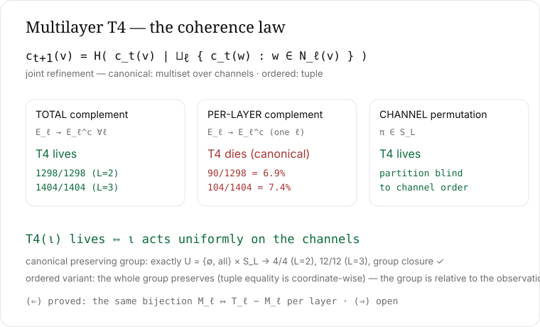
  <br><em>La ley de coherencia multicapa (EXP-162/163): total vive, por-capa muere en la canónica.</em>
</p>


<p align="center">
  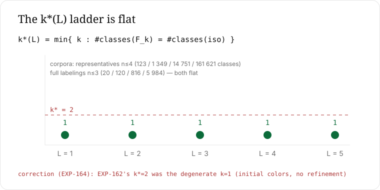
  <br><em>La escalera k\*(L) es plana y corrige el k\*=2 de EXP-162.</em>
</p>

**Los resultados**: (1) **multicapa** — la ley de coherencia: total vive
(1298/1298, 1404/1404), por-capa muere solo en la canónica (6.9%/7.4%);
el grupo preservante es exactamente el uniforme; la escalera `k*` es
plana (corrige el `k*=2` de EXP-162); (⇐) probada, (⇒) abierta.
(2) **matriz** — la frontera se mueve con el observador, no con el
tipado. (3) **hipergrafos** — predicción registrada y acertada
(1831/1831). (4) **aridades** — la escalera vive; el transplante por
aridad **falla** (la ley es de canales). (5) **dual por aridad** —
asimilado: partición 100%, ahorro 14.37% vs 10.26%.


<p align="center">
  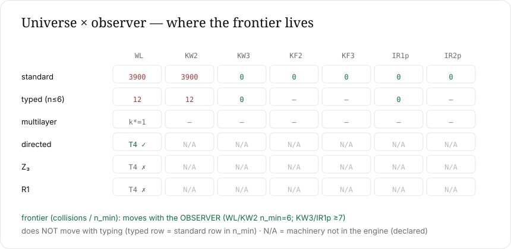
  <br><em>La frontera se mueve con el observador, no con el tipado.</em>
</p>


<p align="center">
  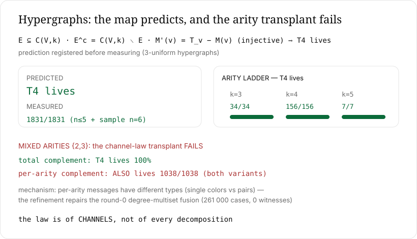
  <br><em>Predicción acertada (1831/1831) y el transplante por aridad que falla.</em>
</p>


<p align="center">
  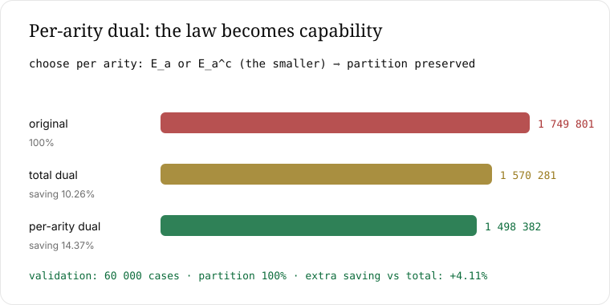
  <br><em>Dual por aridad: ahorro 14.37% con partición garantizada.</em>
</p>


<p align="center">
  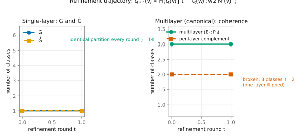
  <br><em>La trayectoria del refinamiento: T4 y la divergencia multicapa.</em>
</p>


<p align="center">
  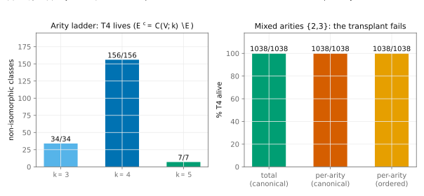
  <br><em>La escalera de aridad y el transplante que falla.</em>
</p>

## 7d. El Santo Grial (SG-01→03)

- **Completitud en la clase**: la familia mínima es **{WL, 2-WL, 3-WL}**
  con **C_8 = 0** en **76 205 685 pares** (n≤8); leave-one-out: k-WL 3
  hace el trabajo; la frontera n=16 (Rook/Shri) la separa solo la familia
  total. Freeze: `resultados/SG-01_results_frozen.json`.

<p align="center">
  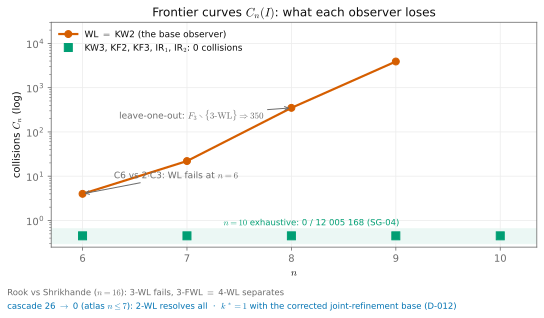
  <br><em>Las curvas de frontera por observador (SG-01/03, EXP-119).</em>
</p>

- **El precio de T4**: el invariante completo **no** es
  complemento-invariante; el cociente `G~Ḡ` fusiona **6 168 pares**.
- **Individualización**: **i\*=1** en n≤8 (13 597 grafos); **i\*=2** en
  Rook/Shrikhande (IR_1 no, IR_2 sí). El retículo IR↔k-WL: en n≤9 los
  completos colapsan (equivalencia vacua); anclas A/B, C no observado.
  Freezes: `SG-02`, `SG-03`.

<p align="center">
  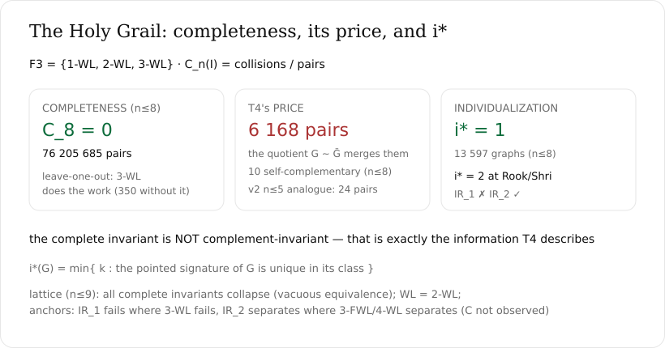
  <br><em>Completitud, el precio de T4 y i\*.</em>
</p>

- **La prueba multicapa** viaja en `paper/PRUEBA-MULTICAPA.md` ((⇐)
  probada, (⇒) abierta) y los **patrones transversales** + el
  `DECISION_LOG` (D-001→D-017) en `paper/DECISION_LOG.md`.

## 7e. SG-04: la puerta (n=10 exhaustivo)

- **0 colisiones** en **12 005 168** grafos n=10 exhaustivos (KW3/IR1p,
  11.1 h) → la primera incompletitud **no está en n=10**.
- Dirigido: 9 combos regulares n=11–15 (tope 5 000) + 10 pares
  Cayley/Paley/Q4 → **0 fallas**.
- La primera falla conocida sigue en **n=16** (Rook/Shri): la separan
  **descriptores elementales** (SNFL, AUT, CICLOS, LOCAL, HOM2) + KF3/
  IR2p. Freeze: `resultados/SG-04_results_frozen.json` (certificado V19).
- Corrección registrada: `geng -d 3` (separado) falla; es `-d3`.

## 8. Estructura del repositorio

```
paper/PAPER.md                   el paper (abstract bilingüe, método, resultados, §12 arco v2)
paper/TEOREMA-UNIVERSOS.md       el ciclo completo EXP-099→119
paper/PRUEBA-CARACTERIZACION.md  la prueba (⇐) y el estado de (⇒)
codigo/universos.py              la ley en el motor (t4_garantizado, oráculo)
codigo/wl.py                     WL simétrico + k-FWL correlacionada (≡ (k+1)-WL)
codigo/verificaciones.py         V1–V12 con asserts de los números exactos
codigo/verificaciones_v2.py      V13–V16 (arco de universos)
codigo/multicapa.py              refinamiento conjunto + tres dualidades (v2)
codigo/hipergrafo.py             k-uniforme + aridades mezcladas + dual (v2)
codigo/individualizacion.py      IR_k (peor/multiset) — SG-02/03 (v2)
paper/PRUEBA-MULTICAPA.md        (⇐) probada, (⇒) abierta (EXP-162)
paper/DECISION_LOG.md            decisiones D-001→D-017 del laboratorio
paper/LITERATURA.md              el mapa y no la respuesta (revisión + posición)
resultados/*.json                freezes originales (EXP-102..169 + SG-01..04)
resultados/atlas/*.json          los 15 universos del atlas (EXP-105)
assets/*.svg                     figuras
index.html · index.en.html       páginas de presentación (ES/EN)
```

---

## 9. Límites y problemas abiertos

- **(⇒) para todo n: abierto.** Verificado en n≤4 exhaustivo, n=5
  dirigido y datos reales; el argumento ∀n es el paso restante.
- **Suficiencia de `f(1)≠f(2)` para `f` arbitraria**: verificada en los
  catálogos; prueba general abierta.
- **El espacio afín completo n≥5** es inabordable (involuciones de S₂₀);
  el espacio probado es el inducido + afín aleatorio.
- **T4**: prueba escrita, **revisión externa pendiente**; formalización
  en Lean no disponible en el entorno.
- **Universos**: definiciones propias, declaradas; el espacio es abierto.
- **Datos**: ChEMBL (CC-BY 4.0), CodeSearchNet, UniProt, Pfam — citados;
  muestras fijas por seed.

---

## 10. Referencias (selección)

- Weisfeiler, Leman (1968). *A reduction of a graph to a canonical form…*
- Morgan (1965); Rogers, Hahn (2010). *Extended-connectivity fingerprints.*
- Dvořák (2010); Dell, Arvind, Larsson (2018). *Homomorphisms and 1-WL.*
- Babai (2016). *Graph isomorphism in quasipolynomial time.*
- Xu et al. (2019). *How powerful are graph neural networks?*
- Morris et al. (2019). *Weisfeiler and Leman go neural.*
- Zamfirescu (1980). *Non-traceable 3-connected planar cubic graphs.*
- Lovász (1970). *Problem on vertex-transitive graphs.*

---


---

## 11. El laboratorio detrás de este resultado

Este paper es un hilo de un **laboratorio de 169 EXP + SG-01/02/03**
(165 con `run.py`; **43 746** líneas; **~2,8 MB** de resultados
congelados) en siete arcos. Cada número está anclado a un
artefacto congelado, y un meta-experimento (**EXP-120**) verifica las
afirmaciones clave: **26/26 hitos**.

| arco | rango | qué construyó |
|---|---|---|
| Fundacional | 000–010 | colapso de taxonomía **0.5876**; moléculas 3.00×; paridad Morgan **1.0000 vs 0.9973**; granularidad k\*=21→24 |
| Riemann | 011–019 | 2 001 052 ceros; JS **0.1350 vs 0.0161**; puente de Euler **0.16110 ⊃ 1/2π**; línea crítica **σ\*=0.50000**; negativos limpios |
| Aritmética/Álgebra/Física | 020–046 | r\* emergente (**0.8934**); WL discreto = Morgan (**0.8877 vs 0.8864**); cálculo estructural sin reglas; NS-3D verificado |
| Descubrimiento/Ontología | 047–079 | código real (129 cadenas / 119 anillos / 152 estrellas); **6/6 hipótesis de proteínas rechazadas por controles**; matemática emergente (λ=νn², ABC 6/6, cascada √5, límite Euler ~1.2); el tribunal |
| **T4** | 080–098 | 68/68 → 19 407 → **2 131 019/2 131 019**; prueba escrita; `refine_dual` 10.3× / 40.5%; banco de conjeturas |
| **Universos** | 099–120 | este paper: ley, caracterización, testigos, búsqueda autónoma, Z₃, aleatorio, k-FWL |
| **Universos v2** | 162–169 | multicapa (ley uniforme, grupo, escalera k\*), matriz universo×observador, hipergrafos (predicción), aridades, dual por aridad |

**Patrones transversales**: congelar antes de interpretar · controles
negativos (una sola pasada del shuffle no es evidencia: varía 0.05–0.84)
· cinco bugs propios cazados y **registrados, no borrados** · cuatro
tipos de resultado: kinds → leyes → teoremas → universos.

Mapa completo: [`paper/MAPA-DEL-LABORATORIO.md`](paper/MAPA-DEL-LABORATORIO.md).


## 12. El motor: cómo funciona y su potencia medida

<p align="center">
  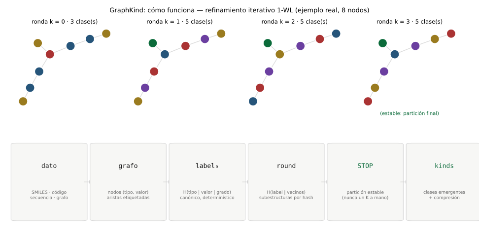
  <br><em>El pipeline del motor: dato → grafo → label₀ → round → STOP → kinds; el ejemplo muestra las rondas 3 → 5 → 5 → 5 hasta la partición estable.</em>
</p>

<p align="center">
  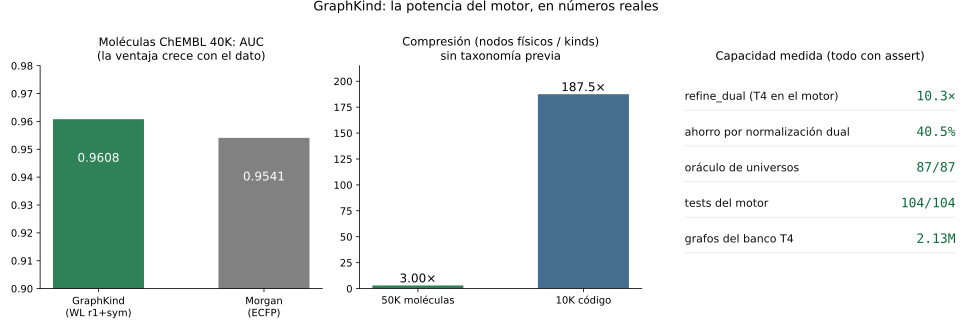
  <br><em>La potencia medida: paridad con Morgan (AUC 0.9608 vs 0.9541), compresión 3.00× (moléculas) y 187.5× (código), <code>refine_dual</code> 10.3×, ahorro por normalización dual 40.5%, oráculo de universos 87/87, tests del motor 104/104, banco T4 2.13M.</em>
</p>

<p align="center">
  <sub>© 2026 Juri (cripto-bot) · preprint · licencia <a href="LICENSE">CC-BY-4.0</a> (atribución requerida).<br>
  Este documento no reclama prioridad sobre problemas abiertos: reporta una caracterización verificada en un dominio acotado.<br>
  Citar como: Argaña Silguero, J. (2026). <em>GraphKind — Universes v2</em> [software y datos]. Zenodo.
  <a href="https://doi.org/10.5281/zenodo.22747350">10.5281/zenodo.22747350</a> (concept DOI; v2.0.0: <a href="https://doi.org/10.5281/zenodo.22747351">10.5281/zenodo.22747351</a>) · ver <a href="CITATION.cff">CITATION.cff</a>.</sub>
</p>
